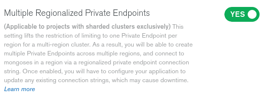
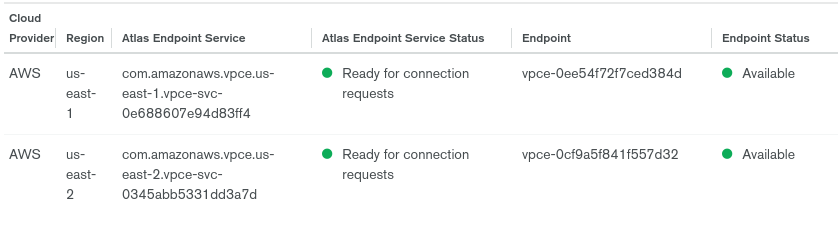

How to deploy an Atlas Cluster across three regions while using privatelink endpoints in only two regions.
===

## Introduction
In order for and Atlas cluster to be able to survive a regional outage, the cluster must be spread between three cloud provider regions. If the cluster is deployed in AWS and privatelink is used to establish a connection to the cluster, there needs to be a privatelink endpoint in each of the regions in which the cluster is deployed. This presents a problem for organizations that have infrastruture in two regions and for whom starting to use a third region is difficult from an administrative standpoint. This guide describes a method for creating an Atlas cluster that can survive a regional outage but only requires privatelink endpoints in two regions.

## Step 1: Preparing your project
1. In your project settings, turn on <b>Multiple Regionalized Private Endpoints
</b> 
2. Establish the privatelink endpoint connections for two regions (for this example we will assume us-east-1 and us-east-2). Follow the documentation [here](https://docs.atlas.mongodb.com/security-private-endpoint) for information on setting this up. 
3. Create an API key with the "project owner" role. Details on how to do this available [here](https://docs.atlas.mongodb.com/configure-api-access).

## Step 2: Running the example script
You could choose to do all the configuration manually, but it is easier to manage if automated.  
4. Put API key info as well as project id into <code>env.config</code>
5. Install dependencies - <b>jq</b> and <b>curl</b> must be installed to run sample script.
6. Run <code>./privatelinkSwitchCreateCluster.sh</code>

## What is the script doing?
This script takes the following actions: 
1. Creates a dummy endpoint in the Atlas project in the third region (in this case us-west-2) and points it to a nonexistend vpce id in AWS. This connection fails, which is fine.
2. With endpoints in all three regions, Atlas will allow us to spin up a sharded cluster (we can have a 1 shard sharded cluster, but it MUST be sharded for this to work)
3. Delete the dummy endpoint once the cluster has started initializing.